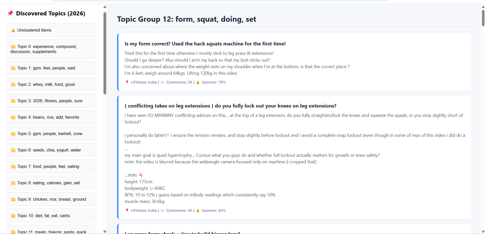
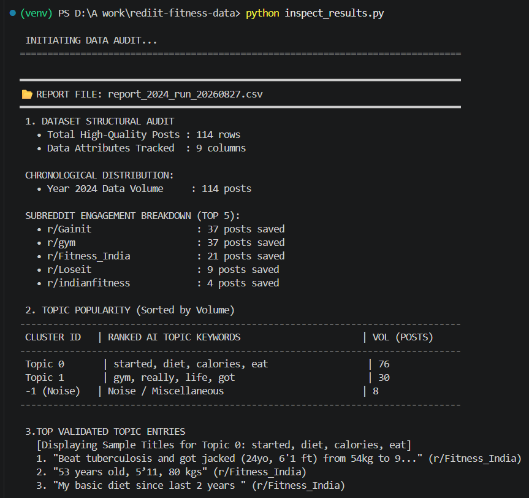
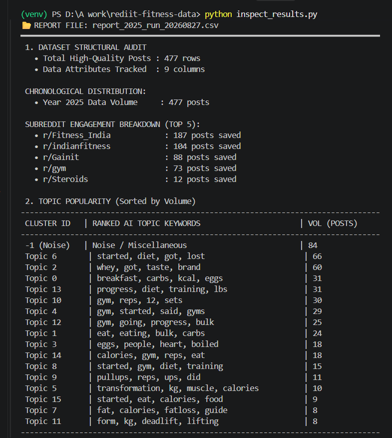
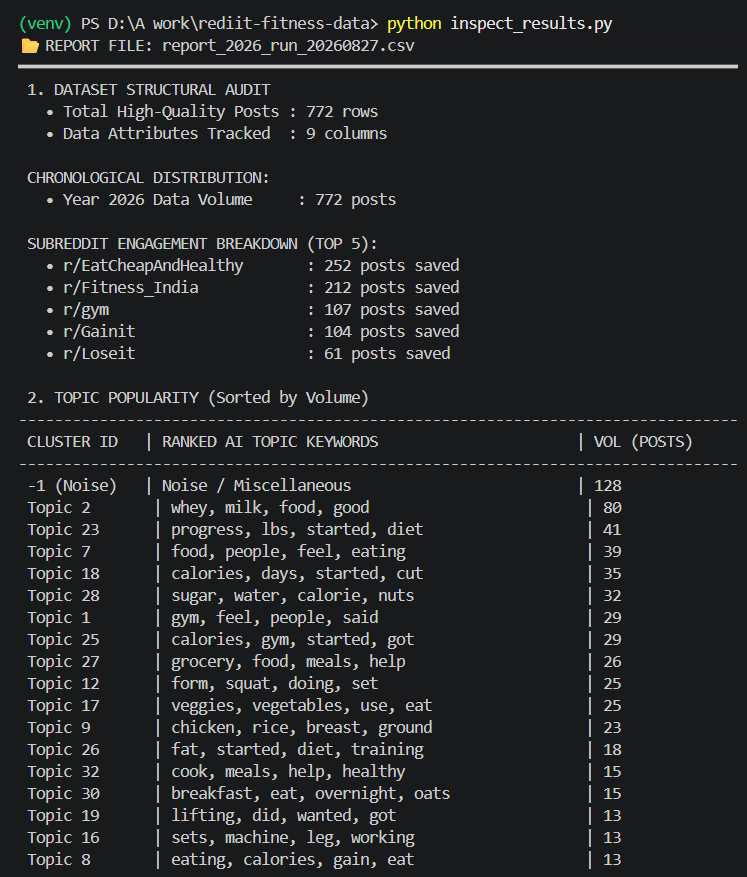

# Reddit Trend Discovery Pipeline

Clusters posts from any set of subreddits into topics by year, without manual labeling. Originally built and validated on fitness subreddits; the pipeline itself is domain-agnostic — subreddit list, filter thresholds, and topic-labeling stopwords are all set in `config.json`, no code changes needed to point it at a different domain.

---


## Output

The pipeline was first built and run end-to-end on fitness subreddits (`Fitness_India`, `gym`, `Gainit`, etc.) across 2024–2026, producing 114/477/772 filtered posts per year with interpretable clusters (e.g. diet/calorie-tracking as the largest topic in all three years).

## Output

<table>
  <tr>
    <td align="center">
      <br>
      <b>Dashboard (2026 Fitness Run)</b>
    </td>
    <td align="center">
      <br>
      <b>Terminal Audit (2024)</b>
    </td>
  </tr>
 
  <tr><td colspan="2" style="padding: 15px 0;"></td></tr>

  <tr>
    <td align="center">
      <br>
      <b>Terminal Audit (2025)</b>
    </td>
    <td align="center">
      <br>
      <b>Terminal Audit (2026)</b>
    </td>
  </tr>
</table>


A career-subreddit run is the next one planned, now that `domain_name` prevents it from merging into the fitness data.


## The Problem


A subreddit accumulates far more posts than anyone can read manually, and buried in that volume is a real signal: what a community keeps asking about, how much of the discussion each topic actually takes up, and how that changes year to year. Reading through it by hand doesn't scale, and doing it by hand also doesn't produce a consistent, comparable count across years.

This pipeline takes raw subreddit posts, filters out low-engagement noise, groups the rest into topics automatically, and reports topic volume per year — turning an unreadable pile of posts into a ranked, comparable view of what a community actually talks about, without any manual reading or manual tagging.

## Approach

```
Reddit API → Scrape + filter → Embed → Reduce dimensions → Cluster → Label → Report
```

1. **Collection** — `1_scraper.py` pulls from each subreddit's `new`, `hot`, and `top` feeds via PRAW, filtered by minimum comment count, upvote ratio, and body length (thresholds set in `config.json`). Deduplicates against previous runs using post ID and a normalized text fingerprint, so reposts and crossposts aren't counted twice. Output files are named `raw_data/{domain_name}_{year}.csv`, where `domain_name` comes from config — this keeps runs on different subreddit sets from silently merging into the same file.

2. **Embedding** — Title + body text is encoded with `all-MiniLM-L6-v2` (384-dim sentence embeddings). Chosen because it runs on CPU and is fast enough for a few thousand short posts; not chosen for maximum accuracy.

3. **Dimensionality reduction** — UMAP reduces 384D to 5D before clustering. HDBSCAN clusters by density, and density estimates get unreliable in high-dimensional space (distances stop being meaningful), so this step exists to make the clustering step actually work.

4. **Clustering** — HDBSCAN groups posts by density in the reduced space. No need to set a target number of clusters in advance, unlike k-means. Posts that don't fall into a dense region are labeled noise (`-1`) instead of forced into the nearest cluster.

5. **Labeling** — Each cluster is labeled with its own top TF-IDF terms, computed per-cluster rather than globally, using a stopword list read from `config.json` (`ai_settings.custom_stopwords`). This is the one place domain leaks into actual behavior, not just naming — switching domains means updating this list so it filters out that domain's filler words (e.g. "weight"/"protein" for fitness, "job"/"company" for career subreddits) instead of leaving them uncaught.

6. **Reporting** — `inspect_results.py` prints a terminal summary per report file. `2_clusterer.py` also writes an HTML dashboard with one clickable topic per cluster and the posts inside it.

## Making this portable across domains

Everything needed to point this at a new topic lives in `config.json`:

- `domain_name` — controls output filenames on both scrape and cluster steps, so different domains never merge into the same CSV
- `target_subreddits` — which communities to pull from
- `filtering_rules` — comment/upvote/length thresholds
- `ai_settings.custom_stopwords` — domain-specific filler words to exclude from cluster labels

No code changes required for a new domain. Code changes are only needed for genuinely new logic (e.g. a new filter type).

## Design decisions & known limitations

- **`min_cluster_size` is a fixed constant across years with very different post counts** — e.g. 114 posts in an early year vs. 700+ in a later one. That means later years get more granular clusters partly because of the constant, not only because of real topic diversity growth. Year-over-year cluster *count* comparisons need to account for this.
- **Some TF-IDF cluster labels are low-signal** — generic words occasionally slip past the stopword list and don't distinguish a cluster from its neighbors. No automated cluster-quality metric (e.g. intra-cluster similarity) exists yet, so tight vs. loose clusters are currently judged by eye.
- **No embedding cache** — `2_clusterer.py` recomputes all embeddings on every run. Fine at current scale, costly for repeated hyperparameter tuning.
- **HTML dashboard content isn't escaped** — post titles/bodies are injected into HTML via f-strings with no `html.escape()`. Not a problem for local viewing, but a real risk if this dashboard is ever served over HTTP, since Reddit post text is uncontrolled input.
- **Scraper error handling is broad** — a rate limit, a bad post, and a genuine bug are all caught by the same `except Exception`, so the terminal can't currently distinguish "this subreddit is fine, just slow" from "something is actually wrong."


## Files

```
1_scraper.py        — collection, filtering, dedup, domain-aware output naming
2_clusterer.py       — embedding, UMAP, HDBSCAN, TF-IDF labeling (config-driven stopwords), HTML/CSV output
inspect_results.py   — terminal audit of a report CSV
config.json           — domain name, subreddits, filter thresholds, model/cluster settings, stopwords
```

## Tech stack

PRAW, pandas, sentence-transformers, UMAP, scikit-learn (HDBSCAN, TF-IDF)

---

## Setup

```bash
pip install -r requirements.txt
```

`.env` with Reddit API credentials:
```
REDDIT_CLIENT_ID=
REDDIT_CLIENT_SECRET=
REDDIT_USER_AGENT=
```

## Usage

```bash
python 1_scraper.py       # collect + filter posts into raw_data/{domain_name}_{year}.csv
python 2_clusterer.py     # embed, cluster, generate output_reports/
python inspect_results.py # terminal summary of a report
```

To run on a new domain: edit `domain_name`, `target_subreddits`, and `custom_stopwords` in `config.json`, then run the pipeline as above.
